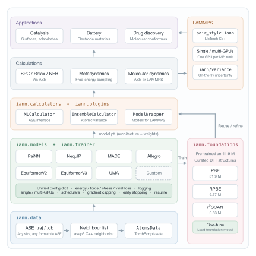
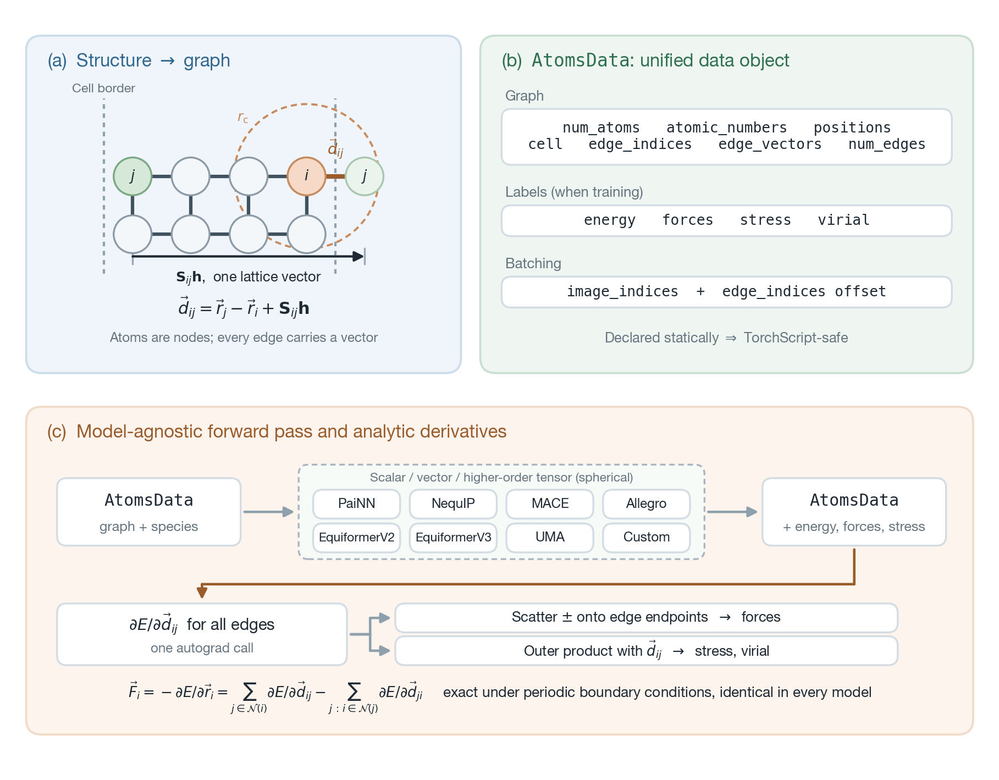

About
=====

Machine-learning interatomic potentials (MLIPs) reproduce density functional theory (DFT)
energies and forces at a small fraction of the cost, but the practical benefit is limited by
software fragmentation: each state-of-the-art architecture is distributed as its own codebase,
with its own data format, configuration system, training loop, checkpoint layout and
molecular-dynamics interface. Comparing two architectures on the same dataset, moving a trained
model from a training script into a production simulation, or extending either one therefore
requires substantial re-engineering.

IANN (InterAtomic Neural Network) places seven equivariant graph neural network architectures
behind a single typed data object, a single trainer and a single deployment route. Every model
consumes and returns the same structure, so the choice of architecture is a one-word change in a
configuration dictionary rather than a change of code base.

Framework structure
-------------------

   Software structure of the IANN framework: five main layers with two auxiliary layers.

**Data layer** (``iann.data``). Trajectories and databases are read through ASE, so any format
ASE supports is accepted. Neighbour lists are built by the compiled C++ ``asap3`` library, whose
cost grows linearly with the number of atoms. Both are packed into ``AtomsData``, a single object
that every architecture accepts directly and that survives TorchScript compilation — so one data
object serves both training in Python and inference inside LAMMPS in C++.

**Models and trainer layer** (``iann.models``, ``iann.trainer``). The architectures are selected
by name in a configuration dictionary; see :doc:`engine_models`. The same trainer handles the
loop, the objective on energies, forces, stresses and virials, logging, checkpointing,
learning-rate scheduling, early stopping and restarts. It also detects the environment and
configures distributed data-parallel training automatically from SLURM, OpenMPI, MPICH/Intel MPI,
MVAPICH2 or PBS without any change to the script (:doc:`parallelization`).

**Calculators and plugins layer** (``iann.calculators``, ``iann.plugins``). A trained checkpoint
is used through unified calculators, which makes the whole ASE ecosystem available without
further code. ``EnsembleCalculator`` runs an ensemble of checkpoints and reports the variance of
the total energy, the forces and per-atom properties directly, which can be used as an
acquisition signal for active learning.

**Calculations and applications layers.** On top of the calculators sit single-point evaluation,
geometry relaxation and nudged-elastic-band searches through ASE, molecular dynamics through
either ASE or LAMMPS, and free-energy methods such as metadynamics through the ASE–PLUMED
calculator. These serve the application domains at the top of the figure: catalysis, battery
materials and drug discovery.

**Foundation models** (``iann.foundations``). So that a project need not begin by training from
scratch, IANN distributes pretrained potentials trained on 41.9 million curated DFT structures
and grouped by exchange–correlation functional. Each can be used as a zero-shot calculator or as
the initialisation for fine-tuning on a small in-house dataset; see :doc:`foundation_models`.

**Deployment to LAMMPS.** For production molecular dynamics at sizes and timescales a Python
driver cannot reach, the compiled model runs inside LAMMPS itself through ``pair_style iann``.
The bundled pair styles use the LibTorch C++ API in serial or across multiple GPUs, and a
companion compute reports energy and force variances as ordinary thermodynamic output, so a
trajectory can be monitored for excursions outside the training distribution while it runs
(:doc:`lammps`).

Underlying mechanism
--------------------

What makes that uniformity possible is three shared components: one graph convention, one data
object passed to and returned by every architecture, and one derivative route.

   One graph convention, one data object and one derivative route, shared by every architecture.
   (a) A structure becomes a graph: atom :math:`i` bonds to atom :math:`j` within the cutoff
   :math:`r_\mathrm{c}`. (b) The unified data object ``AtomsData``, which describes the graph and
   its associated data. (c) The architecture-independent forward pass that yields forces, stress
   and virial.

**Graph convention.** A structure is converted into tensors before any architecture sees it:
nodes as a single integer array of atomic numbers, edges as integer index arrays plus edge
vectors :math:`\vec{d}_{ij}`. The graph is directed, so each bond appears twice, once from
:math:`i` to :math:`j` and once from :math:`j` to :math:`i`. The image shift
:math:`\mathbf{S}_{ij}\mathbf{h}` applies only to periodic systems. The edge vectors are flagged
as requiring gradients, which is what makes the single differentiation below possible.

**Unified data object.** The graph is packed into ``AtomsData``, which every architecture both
consumes and returns — this is what keeps the trainer and the calculators architecture-agnostic.
The same object carries the training labels, the batching indices and optional intermediate
representations, variances and ensemble information. Its fields are declared statically, so it is
TorchScript-compatible and the same model object can be compiled for LAMMPS with no
architecture-specific adapter.

**Derivative route.** Every architecture exposes the same ``forward``, from ``AtomsData`` to
``AtomsData``, and forces come from one differentiation with respect to the edge vectors. Those
same per-edge gradients give the stress and the virial through a second contraction — against the
edge vectors rather than onto their endpoints — so all three derived quantities come out of a
single backward pass, exactly under periodic boundary conditions. The loss, the trainer, the
calculators and the TorchScript exporter are written against that signature alone and contain no
architecture-specific code. Two things follow: the choice of network becomes a configuration
value, so architectures can be trained and evaluated with one script; and one wrapper exports
every architecture to LAMMPS, so adding a new architecture leaves the deployment route untouched.

Citing IANN
-----------

If you use IANN, please cite the software release:

.. code-block:: bibtex

   @software{IANN,
     author  = {Ai, Changzhi},
     title   = {{IANN}: InterAtomic Neural Network framework},
     year    = {2025},
     doi     = {10.5281/zenodo.17809949},
     url     = {https://github.com/changzhiai/IANN}
   }

IANN is released under the MIT licence. The source is on
`GitHub <https://github.com/changzhiai/IANN>`_, where questions and issue reports are welcome.
