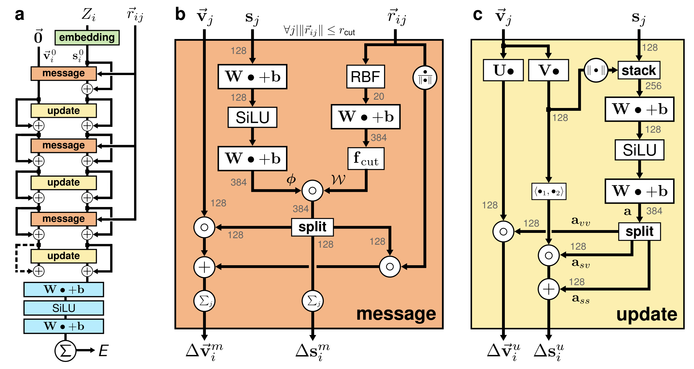
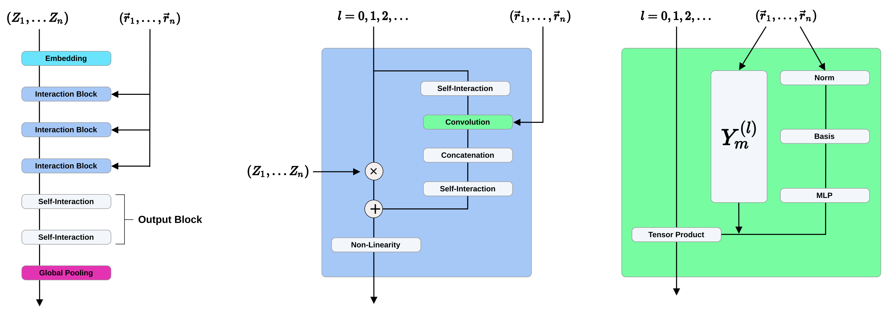
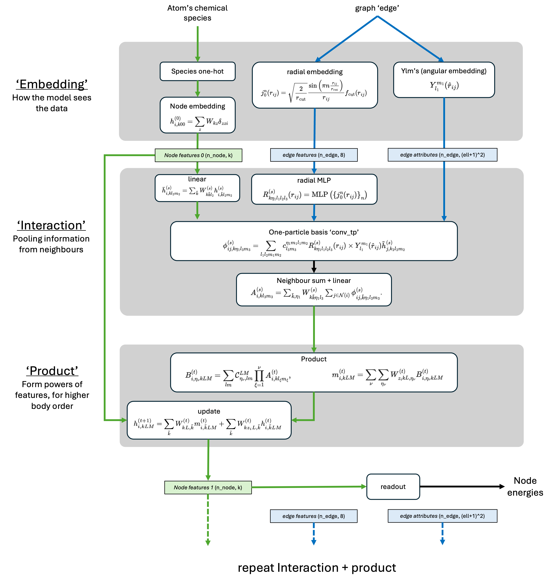
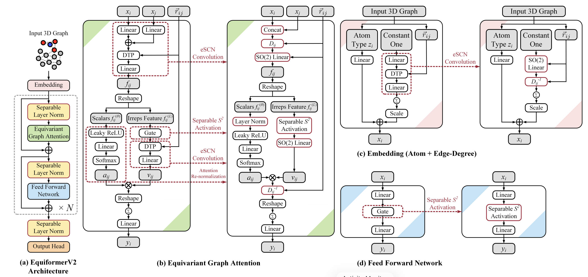
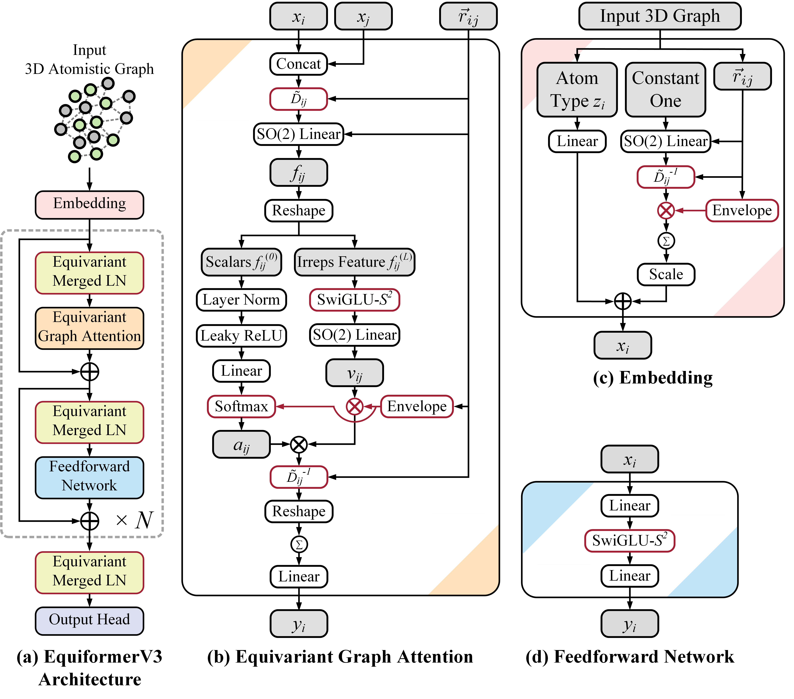
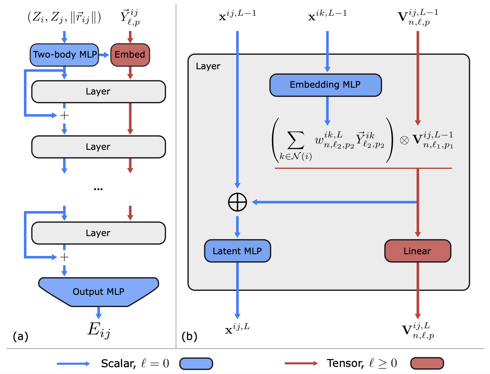
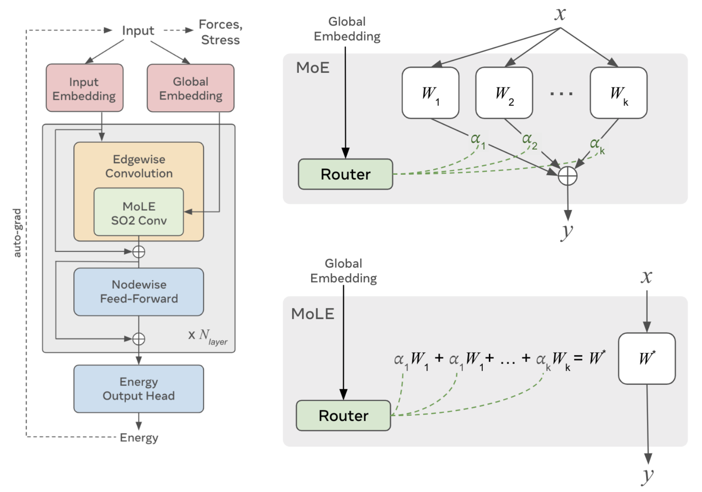

Engine Models
==============

This guide covers the backend models available in IANN, including their architectures, features, and use cases.

Overview
--------

IANN implements several state-of-the-art architectures for interatomic potentials. All of them are graph-based equivariant neural networks:

- `PaiNN <https://arxiv.org/abs/2102.03150>`_ (Polarizable atom interaction Neural Network)
- `NequIP <https://doi.org/10.1038/s41467-022-29939-5>`_ (Neural equivariant Interatomic Potentials)
- `MACE <https://arxiv.org/abs/2206.07697>`_ (Message-passing Atomic Cluster Expansion)
- `EquiformerV2 <https://arxiv.org/abs/2306.12059>`_ (Equivariant Transformer V2)
- `EquiformerV3 <https://doi.org/10.48550/arXiv.2604.09130>`_ (equivariant attention with a higher-degree, order-truncated backbone)
- `Allegro <https://doi.org/10.1038/s41467-023-36329-y>`_ (strictly local equivariant potential)
- `UMA <https://arxiv.org/abs/2506.23971>`_ (Universal Models for Atoms)
- `FastPot <https://github.com/changzhiai/IANN/blob/master/iann/models/fastpot.py>`_ (IANN's own lightweight potential with high-order tensor features)

Each model has its own strengths and is suitable for different applications.

.. note::
   The term *architecture* is used here for the network design, and *foundation model* for a set
   of pretrained weights. The released pretrained checkpoints are covered in
   :doc:`foundation_models`.

.. note::
   NVIDIA Python library ``cuEquivariance`` is an optional dependency for the ``NequIP``, ``MACE`` and ``Allegro`` models. If you want to use the optimized operations, you need to install it, and the models will automatically use it (the flag is ``use_cue``, which defaults to autodetection). Please check the official website `cuEquivariance <https://docs.nvidia.com/cuda/cuequivariance/>`_ for more details.

PaiNN
-----

PaiNN is a message-passing neural network that considers features including:

* Scalar: atomic number, distance
* Vector: coordinate difference

   The PaiNN architecture: (a) the network, alternating message and update blocks over scalar
   and vector features; (b) the message block; (c) the update block. Reproduced from
   Schütt *et al.*, `arXiv:2102.03150 <https://arxiv.org/abs/2102.03150>`_.

Key features:

* High computational efficiency
* Good balance of accuracy and speed
* Suitable for general-purpose applications

Example usage:

.. code-block:: python

   from iann.models.painn import PaiNN
   
   model = PaiNN(
       num_layers=3,
       num_channels=128,
       cutoff=5.5,
       compute_forces=True
   )

There are more adjustable parameters for PaiNN model to setup the training process, please check the source code :class:`iann.models.painn.PaiNN` for more details (all adjustable parameters are passed as `kwargs.get` in the model class).

NequIP
------

NequIP is an equivariant neural network that considers features including:

* Scalar: atomic number, distance
* Vector: coordinate difference
* Higher-order tensor: high order rotation

   NequIP: the network with stacked interaction blocks (left), one interaction block (middle),
   and the equivariant convolution built from spherical harmonics (right). Reproduced from
   Batzner *et al.*, `Nat. Commun. 13, 2453 (2022) <https://doi.org/10.1038/s41467-022-29939-5>`_.

Key features:

* Excellent accuracy
* Uses spherical harmonics symmetries
* Good for high-precision applications

Example usage:

.. code-block:: python

   from iann.models.nequip import NequIP
   
   model = NequIP(
       num_layers=3,
       num_channels=64,
       cutoff=5.5,
       compute_forces=True
   )

There are more adjustable parameters for NequIP model to setup the training process, please check the source code :class:`iann.models.nequip.NequIP` for more details (all adjustable parameters are passed as `kwargs.get` in the model class).

MACE
----

MACE combines message-passing architecture and multi-body expansion, which considers features including:

* Scalar: atomic number, distance
* Vector: coordinate difference
* Higher-order tensor: high order rotation
* multi-body expansion

   MACE in three stages: *embedding* of chemical species with radial and angular information,
   *interaction* which pools over neighbours into the one-particle basis, and *product* which
   forms powers of those features to reach higher body order. Reproduced from Batatia *et al.*,
   `arXiv:2206.07697 <https://arxiv.org/abs/2206.07697>`_.

Key features:

* Fast training and inference
* Good scaling properties
* Suitable for large-scale applications

Example usage:

.. code-block:: python

   from iann.models.mace import MACE
   
   model = MACE(
       num_layers=3,
       num_channels=64,
       cutoff=5.5,
       compute_forces=True
   )

There are more adjustable parameters for MACE model to setup the training process, please check the source code :class:`iann.models.mace.MACE` for more details (all adjustable parameters are passed as `kwargs.get` in the model class).

EquiformerV2
------------

EquiformerV2 is a transformer-based model that:

* Uses attention mechanisms
* Preserves physical symmetries

   EquiformerV2: (a) the architecture, (b) equivariant graph attention, (c) the atom and
   edge-degree embedding, (d) the feed-forward network. Red marks the components introduced in
   that work, including the eSCN convolution and the separable :math:`S^2` activation.
   Reproduced from Liao *et al.*, `arXiv:2306.12059 <https://arxiv.org/abs/2306.12059>`_.

Key features:

* State-of-the-art accuracy
* Good for complex systems

Example usage:

.. code-block:: python

   from iann.models.equiformerV2 import EquiformerV2
   
   model = EquiformerV2(
       num_layers=3,
       num_channels=32,
       cutoff=5.5,
       compute_forces=True
   )

There are more adjustable parameters for EquiformerV2 model to setup the training process, please check the source code :class:`iann.models.equiformerV2.EquiformerV2` for more details (all adjustable parameters are passed as `kwargs.get` in the model class).

EquiformerV3
------------

EquiformerV3 extends the equivariant-attention design of EquiformerV2 to a higher spherical
harmonic degree while truncating the order retained at each degree, which buys angular
resolution at a lower cost than raising the degree alone would imply.

   EquiformerV3: (a) the architecture, (b) equivariant graph attention, (c) the embedding,
   (d) the feedforward network. Red marks what is new relative to EquiformerV2 -- the merged
   equivariant layer norm, the SwiGLU-:math:`S^2` activation and the radial envelope.
   Reproduced from Liao *et al.*,
   `arXiv:2604.09130 <https://doi.org/10.48550/arXiv.2604.09130>`_.

Key features:

* Highest force accuracy of the seven architectures on the MPtrj benchmark
* Higher degree (:math:`\ell_{\max}=3`) at a truncated order (:math:`m_{\max}=2`)
* Roughly half the per-call latency of EquiformerV2

Example usage:

.. code-block:: python

   from iann.models.equiformerV3 import EquiformerV3

   model = EquiformerV3(
       num_layers=3,
       num_channels=32,
       cutoff=5.5,
       compute_forces=True
   )

There are more adjustable parameters for EquiformerV3 model to setup the training process, please check the source code :class:`iann.models.equiformerV3.EquiformerV3` for more details (all adjustable parameters are passed as `kwargs.get` in the model class).

Allegro
-------

Allegro is a strictly local equivariant potential: it builds many-body features along each edge
without message passing between atoms, so the energy decomposition stays local by construction
and the model parallelises without halo exchange of features.

   Allegro: (a) the strictly local, edge-centred network producing a pair energy
   :math:`E_{ij}`; (b) one layer. Blue carries scalars (:math:`\ell=0`), red the higher-order
   tensors (:math:`\ell \geq 0`). Reproduced from Musaelian *et al.*,
   `Nat. Commun. 14, 579 (2023) <https://doi.org/10.1038/s41467-023-36329-y>`_.

Key features:

* Strictly local, so no message passing between neighbouring atoms
* Smallest parameter count of the seven architectures
* Highest per-atom cost, so best suited to smaller cells

Example usage:

.. code-block:: python

   from iann.models.allegro import Allegro

   model = Allegro(
       num_layers=4,
       num_channels=128,
       cutoff=5.5,
       compute_forces=True
   )

There are more adjustable parameters for Allegro model to setup the training process, please check the source code :class:`iann.models.allegro.Allegro` for more details (all adjustable parameters are passed as `kwargs.get` in the model class).

UMA
---

UMA replaces the SO(3) tensor product with a rotated-frame construction: each edge is rotated so
that its direction lies along a common axis, in which frame the convolution factorises into
independent SO(2) convolutions over spherical channels. It also conditions on charge, spin and
source dataset, so one set of weights can serve several domains.

   UMA: the eSCN-MD backbone, whose edgewise convolution uses a mixture-of-linear-experts SO(2)
   convolution conditioned on a global embedding (left); and the MoE and MoLE routing schemes
   (right), where MoLE mixes the expert *weights* rather than their outputs. Reproduced from
   Wood *et al.*, `arXiv:2506.23971 <https://arxiv.org/abs/2506.23971>`_.

Key features:

* Best energy accuracy of the seven architectures on the MPtrj benchmark
* Charge, spin and dataset conditioning
* Moderate cost for an attention-class model

Example usage:

.. code-block:: python

   from iann.models.uma import UMA

   model = UMA(
       num_layers=3,
       num_channels=64,
       cutoff=5.5,
       compute_forces=True
   )

There are more adjustable parameters for UMA model to setup the training process, please check the source code :class:`iann.models.uma.UMA` for more details (all adjustable parameters are passed as `kwargs.get` in the model class).

FastPot
-------

.. note::
   FastPot is IANN's own lightweight model rather than a published architecture, and it is not
   part of the seven-architecture comparison reported in the IANN paper. It is fully supported —
   trainable, loadable and exportable — but to reproduce or compare against published numbers,
   use one of the seven architectures above.

FastPot is a high-performance neural network model that combines the power of high-order tensor features and equivariant message passing for fast and accurate potential energy surface prediction.

Key features:

* Very high computational efficiency
* Good balance of accuracy and speed
* Suitable for general-purpose applications

Example usage:

.. code-block:: python

   from iann.models.fastpot import FastPot

   model = FastPot(
       num_layers=3,
       num_channels=128,
       cutoff=5.5,
       compute_forces=True
   )

There are more adjustable parameters for FastPot model to setup the training process, please check the source code :class:`iann.models.fastpot.FastPot` for more details (all adjustable parameters are passed as `kwargs.get` in the model class).

Model Selection
---------------

The table below is measured, not indicative. Accuracy is from training all seven architectures on
the same cleaned MPtrj database (1,579,091 PBE structures) through the same trainer, graph
construction and evaluation code. Cost is one energy-and-force call on a single Tesla
V100-PCIE-32GB in float32 at a 5.5 |angstrom| cutoff, on bulk fcc Pt supercells.

.. list-table::
   :header-rows: 1
   :widths: 16 12 12 12 12 12 12

   * - Architecture
     - Parameters
     - :math:`E` MAE (eV/atom)
     - :math:`F` MAE (eV/|angstrom|)
     - Latency floor (ms)
     - Marginal cost (|micro|\ s/atom)
     - Largest cell (atoms)
   * - PaiNN
     - 600,577
     - 0.041
     - 0.050
     - 9.0
     - 15.9
     - 10,976
   * - NequIP
     - 1,379,513
     - 0.050
     - 0.069
     - 24.3
     - 18.5
     - 10,976
   * - Allegro
     - 567,624
     - 0.040
     - 0.066
     - 19.1
     - 180.7
     - 4,000
   * - MACE
     - 1,429,376
     - 0.054
     - 0.069
     - 20.8
     - 15.0
     - 10,976
   * - EquiformerV2
     - 773,089
     - 0.040
     - 0.059
     - 114.6
     - 306.7
     - 864
   * - EquiformerV3
     - 943,249
     - 0.040
     - 0.046
     - 53.6
     - 171.6
     - 2,048
   * - UMA
     - 1,173,698
     - 0.029
     - 0.040
     - 28.4
     - 91.4
     - 6,912

How to read it:

1. **Accuracy.** The spread is modest: 29 to 54 meV/atom on energies, a factor under two. UMA is
   best on energies and EquiformerV3 on forces. PaiNN stays competitive at the second-smallest
   parameter count, which is why the released foundation models use it.

2. **Latency versus throughput.** Below the latency floor a call costs the same regardless of
   system size, because the GPU is not saturated; above it, cost is linear in the number of atoms
   and the marginal cost decides. The crossover is a few hundred to ~1,400 atoms depending on the
   architecture. For the few-hundred-atom cells typical of surface work you are choosing latency;
   for bulk molecular dynamics at thousands of atoms you are choosing marginal cost, where the
   architectures differ by a factor of twenty.

3. **Memory is often the binding constraint, not speed.** On a 32 GB card PaiNN, NequIP and MACE
   reach 10,976 atoms, while EquiformerV2 runs out at 864. An architecture can be ruled out for a
   target system size before its speed matters.

.. |angstrom| unicode:: U+00C5
.. |micro| unicode:: U+00B5

For detailed API documentation of each model, see the :doc:`api` reference. 