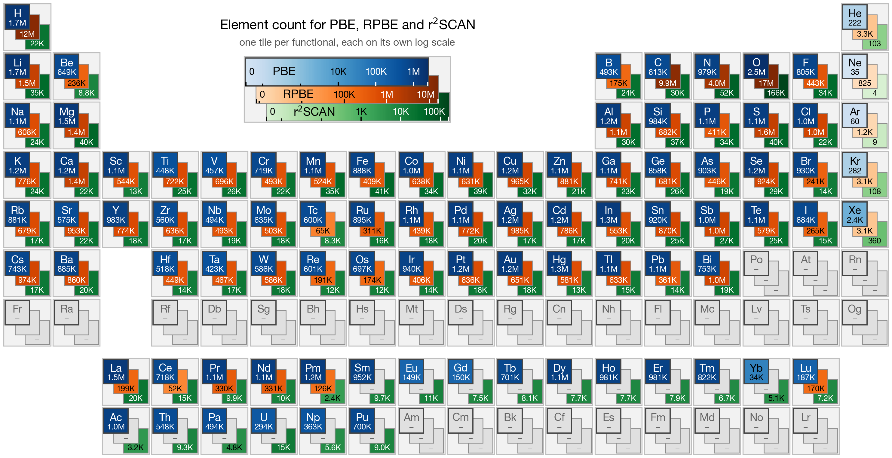

Foundation Models
=================

A foundation model is a set of pretrained weights, as opposed to an *architecture* (a network
design). The architectures IANN implements are covered in :doc:`engine_models`; this page covers
the pretrained checkpoints released with the framework.

Twelve PaiNN foundation models are released, grouped by exchange-correlation functional. Grouping
by functional rather than pooling everything keeps each model on a single energy scale, so a user
working at the RPBE level normally used for adsorption energetics is not forced to accept a prior
averaged over inconsistent references.

They are intended as *priors*: a starting point for fine-tuning on the small in-house dataset a
single project can afford, rather than finished potentials. See `Fine-tuning`_ below.

DFT databases
-------------

Training a foundation model needs data at a single, consistent level of theory, but the public DFT
datasets are spread across functionals and vary in quality. Published trajectories were therefore
screened for energy and force outliers and reassembled into three databases, one per functional,
converted to a single ASE trajectory format that the framework reads directly with no
preprocessing step.

.. list-table::
   :header-rows: 1
   :widths: 14 22 28 12 12 12

   * - Functional
     - Source dataset
     - System type
     - Structures
     - Atoms (M)
     - Elements
   * - PBE
     - MPtrj
     - Bulk, relaxations
     - 1.58 M
     - 49.2
     - 89
   * - PBE
     - sAlex
     - Bulk, relaxations
     - 10.4 M
     - 107.5
     - 89
   * - PBE
     - OMat24
     - Bulk, off-equilibrium
     - 11.3 M
     - 157.1
     - 89
   * - PBE
     - MatPES
     - Bulk, MD snapshots
     - 0.43 M
     - 3.9
     - 89
   * - **PBE**
     - **all four merged**
     -
     - **23.7 M**
     - **317.6**
     - **89**
   * - RPBE
     - OC20 (2M subset)
     - Adsorbates, metals
     - 2.00 M
     - 146.5
     - 56
   * - RPBE
     - OC22
     - Adsorbates, oxides
     - 8.20 M
     - 654.3
     - 57
   * - RPBE
     - OC25
     - Solid–liquid interfaces
     - 7.37 M
     - 1064.3
     - 73
   * - **RPBE**
     - **all three merged**
     -
     - **17.6 M**
     - **1865.1**
     - **74**
   * - r²SCAN
     - MP r²SCAN
     - Bulk, relaxations
     - 0.24 M
     - 5.0
     - 88
   * - r²SCAN
     - MatPES r²SCAN
     - Bulk, MD snapshots
     - 0.39 M
     - 3.0
     - 89
   * - **r²SCAN**
     - **both merged**
     -
     - **0.63 M**
     - **8.1**
     - **89**

41.9 million labelled structures in total. The databases are available as a
`HuggingFace dataset <https://huggingface.co/datasets/changzhiai/dft-databases>`_.

The three levels differ in chemical scope as much as in size:

   Elemental composition of the three curated databases: the number of structures containing each
   element, on a logarithmic colour scale. Each element is one cell of three tiles stepping from
   the top left to the bottom right — PBE (blue), RPBE (orange) and r²SCAN (green). Each tile is
   scaled independently, darker meaning more; grey with a dash means the database contains no
   structure with that element.

PBE and r²SCAN span essentially the whole periodic table, including the lanthanides and the
actinides up to Pu, but differ by more than an order of magnitude in depth. RPBE is the opposite:
no actinides and only six lanthanides, but 17 million structures containing oxygen and 12 million
containing hydrogen — a direct reflection of its origin in surface and solid–liquid-interface
catalysis. So the choice of prior is a choice of chemical scope, not only of functional: for an
oxide surface the RPBE models have seen far more relevant chemistry than their structure count
alone suggests, while an f-block system is only covered at the PBE and r²SCAN levels.

.. note::
   Because these databases were cleaned using the residuals of a trained model, the structures
   removed are exactly the hard ones. That makes them well suited to training but **unsuitable for
   benchmarking** against published numbers — use the original datasets for that.

Released models
---------------

Two families of checkpoints are released: twelve PaiNN foundation models, one per database at
three DFT levels, and seven architecture-comparison runs on a single database.

At three DFT levels
~~~~~~~~~~~~~~~~~~~

All twelve share the same architecture — PaiNN with 128 channels, 3 layers, a 5.5 |angstrom|
cutoff and 600,577 parameters — so the differences between rows reflect the training data rather
than the network. Errors are evaluated over the database each model was trained on, after outlier
removal, so they measure fit rather than extrapolation.

.. list-table::
   :header-rows: 1
   :widths: 20 12 30 16 11 11

   * - Name
     - Functional
     - Training database
     - Structures
     - :math:`E` MAE (eV/atom)
     - :math:`F` MAE (eV/|angstrom|)
   * - ``pbe-mptrj``
     - PBE
     - MPtrj
     - 1,579,058
     - 0.0517
     - 0.0498
   * - ``pbe-salex``
     - PBE
     - sAlex
     - 10,422,893
     - 0.0408
     - 0.0513
   * - ``pbe-omat24``
     - PBE
     - OMat24
     - 11,261,400
     - 0.0261
     - 0.1382
   * - ``pbe-matpes``
     - PBE
     - MatPES
     - 434,083
     - 0.0463
     - 0.0930
   * - ``pbe-all``
     - PBE
     - MPtrj + sAlex + OMat24 + MatPES
     - 23,694,325
     - 0.0545
     - 0.1039
   * - ``rpbe-oc20``
     - RPBE
     - OC20
     - 1,999,216
     - 0.0263
     - 0.0630
   * - ``rpbe-oc22``
     - RPBE
     - OC22
     - 8,198,695
     - 0.0381
     - 0.0528
   * - ``rpbe-oc25``
     - RPBE
     - OC25
     - 7,369,601
     - 0.0116
     - 0.0753
   * - ``rpbe-all``
     - RPBE
     - OC20 + OC22 + OC25
     - 17,553,809
     - 0.0454
     - 0.0712
   * - ``r2scan-mptrj``
     - r\ :sup:`2`\ SCAN
     - MPtrj (r\ :sup:`2`\ SCAN subset)
     - 238,241
     - 0.0206
     - 0.0117
   * - ``r2scan-matpes``
     - r\ :sup:`2`\ SCAN
     - MatPES (r\ :sup:`2`\ SCAN)
     - 387,285
     - 0.0446
     - 0.1127
   * - ``r2scan-all``
     - r\ :sup:`2`\ SCAN
     - MPtrj + MatPES (r\ :sup:`2`\ SCAN)
     - 625,243
     - 0.0678
     - 0.0655

.. note::
   The merged models (``pbe-all``, ``rpbe-all``, ``r2scan-all``) span the chemical scope of all
   their constituents, and pay for that breadth in accuracy: at every functional level the merged
   model is worse on energies than the best of the models it subsumes. Both the specialised and
   the merged checkpoints are released so you can pick the closer prior for your system.

Across architectures
~~~~~~~~~~~~~~~~~~~~

Seven further checkpoints are released — the same curated MPtrj database (1,579,091 PBE
structures) trained with each of the seven architectures. Because the data, the graph convention,
the loss and the evaluation code are the same objects in every run, the differences between rows
are attributable to the networks. Every run used a 5.5 |angstrom| cutoff, the Adam optimiser and
the same gradient-clipping and early-stopping rules; depth, channel width and angular resolution
were chosen per architecture to land near one million parameters, and learning rates were set per
architecture because the optimal value differs.

.. list-table::
   :header-rows: 1
   :widths: 30 18 18 17 17

   * - Name
     - Architecture
     - Parameters
     - :math:`E` MAE (eV/atom)
     - :math:`F` MAE (eV/|angstrom|)
   * - ``painn-pbe-mptrj``
     - PaiNN
     - 600,577
     - 0.041
     - 0.050
   * - ``nequip-pbe-mptrj``
     - NequIP
     - 1,379,513
     - 0.050
     - 0.069
   * - ``allegro-pbe-mptrj``
     - Allegro
     - 567,624
     - 0.040
     - 0.066
   * - ``mace-pbe-mptrj``
     - MACE
     - 1,429,376
     - 0.054
     - 0.069
   * - ``equiformerv2-pbe-mptrj``
     - EquiformerV2
     - 773,089
     - 0.040
     - 0.059
   * - ``equiformerv3-pbe-mptrj``
     - EquiformerV3
     - 943,249
     - 0.040
     - 0.046
   * - ``uma-pbe-mptrj``
     - UMA
     - 1,173,698
     - 0.029
     - 0.040

Parameter count is the only size measure comparable across architectures; the per-run depth,
channel width, :math:`\ell_\mathrm{max}` and :math:`m_\mathrm{max}` are given in the paper's
supporting information. Use
:func:`~iann.foundations.foundation_models.list_foundation_models` to list these checkpoints.

.. note::
   This is not a controlled ablation — the architectures differ in parameter count and in
   hyperparameters that cannot be held fixed across them. Read it as what the framework produces
   in practice, not as a ranking. Inference cost differs far more than accuracy does between these
   rows; see :doc:`performance`.

Getting a model
---------------

Pass a name from the table to ``foundation_model()``. The first call downloads the checkpoint from
the `HuggingFace Hub <https://huggingface.co/changzhiai/iann-foundation-models>`_ and caches it;
later calls are served from the cache.

.. code-block:: python

   from iann.foundations import foundation_model

   path = foundation_model("rpbe-all")     # downloads on first use, then cached

The same function also accepts a path to a checkpoint of your own, which is returned unchanged:

.. code-block:: python

   path = foundation_model("output/model.pt")

Names are matched case-insensitively and accept the spellings used in the paper, so
``"rpbe-all"``, ``"RPBE-all"`` and ``"rpbe_all"`` are equivalent.

To inspect a model without loading it:

.. code-block:: python

   from iann.foundations import foundation_model_info, foundation_models_table

   print(foundation_models_table())        # the table above, as text
   print(foundation_model_info("rpbe-all"))

Offline models
--------------

Another optional way to use the models is to download them offline. Downloads are cached by ``huggingface_hub``, so they honour the usual environment variables:

* ``HF_HOME`` — move the cache off your home directory. On HPC systems, point this at shared
  scratch so that one cache serves every node and you stay inside home-directory quotas.
* ``IANN_FOUNDATION_CACHE`` — an IANN-specific override, if you want the checkpoints somewhere
  other than the HuggingFace cache.
* ``HF_TOKEN`` — for a private or gated repository.

Compute nodes frequently have no network access. Prefetch on a login node:

.. code-block:: python

   from iann.foundations import download_foundation_model
   download_foundation_model("rpbe-all")

or from the shell:

.. code-block:: bash

   hf download changzhiai/iann-foundation-models painn/rpbe/all/rpbe.pt

Then, inside the job, guarantee that nothing touches the network:

.. code-block:: python

   path = foundation_model("rpbe-all", local_files_only=True)

:func:`~iann.foundations.foundation_models.is_cached` reports whether a model can be resolved
without network access, and :func:`~iann.foundations.foundation_models.list_available_models`
lists everything usable right now — the checkpoints bundled in the package plus anything already
cached.

.. note::
   The catalog is pinned to a specific revision of the Hub repository, so a name always resolves
   to the same weights. This matters for reproducibility: a result that cites ``rpbe-all`` refers
   to one definite checkpoint.

Prediction
----------

For example, you can use the following code to load a foundation model:

.. code-block:: python

   from iann.foundations import foundation_model
   from iann.calculators import MLCalculator
   from ase.build import fcc100

   calc = MLCalculator(
      model_path=foundation_model("rpbe-all"), # RPBE prior, trained on OC20+OC22+OC25
      compute_forces=True,
      device='cpu') # use 'cuda' for GPU

   atoms = fcc100("Pt", size=(4,4,3), a=5.5, vacuum=15.0)
   atoms.calc = calc
   nnp_energy = atoms.get_potential_energy()
   nnp_forces = atoms.get_forces()
   print(f"NNP Energy: {nnp_energy:.4f} eV")
   print(f"NNP Forces: {nnp_forces}")

.. _Fine-tuning:

Fine-tuning
-----------

And you can fine tune the foundation model on your own dataset by using the following code. Pass
the checkpoint as ``load_model``; ``reset_lr`` starts a fresh learning-rate schedule instead of
resuming the pre-training one, which is what you want when adapting a prior to new chemistry:

.. code-block:: python

   from iann.trainer import Trainer
   from iann.foundations import foundation_model

   trainer = Trainer(model="painn",
        config={"num_channels": 128, # number of channels in the model
            "num_layers": 3, # number of layers in the model
            "cutoff": 5.5, # cutoff radius
            "batch_size": 16, # batch size
            "learning_rate": 0.0001, # initial learning rate
            "forces_weight": 0.9, # weight for forces
            "load_model": foundation_model("rpbe-all"), # load the foundation model
            "reset_lr": True, # start a fresh schedule rather than resuming
            "max_steps": 10000000, # maximum number of steps
            "random_seed": 888, # random seed for reproducibility
            "val_ratio": 0.003, # validation ratio
            "stop_patience": 500, # patience for early stopping
            'device': 'cuda',
            'output_dir': 'output',
            'output_log': 'output.log',
            'output_model': 'model.pt'},
        distributed=False)
   trainer.train("dataset.traj")

The architecture must match the checkpoint: the released models are PaiNN, so fine-tuning them
requires ``model="painn"``.

.. note::
   Fine-tuning is not always better than using a model zero-shot. On a small in-house dataset the
   fine-tuned model can be worse on adsorption energies than leaving the prior untouched; the
   advantage appears once roughly a hundred relaxation trajectories are available. Validate
   against your own held-out set before trusting a fine-tuned model.

Bundled checkpoints
-------------------

Four older checkpoints ship inside the package itself and resolve without any download:

* ``painn_oc.pt`` — 128 channels, trained on OC20 and OC22; superseded by ``rpbe-all``.
* ``painn_mptrj.pt`` — 128 channels, trained on MPtrj; superseded by ``pbe-mptrj``.
* ``painn_oc_124.pt`` and ``painn_oc_132.pt`` — as ``painn_oc.pt`` but 124 and 132 channels wide
  respectively. Together with the 128-channel model they form a three-member set that
  :class:`~iann.calculators.calculators.EnsembleCalculator` can use for uncertainty estimates
  (see :doc:`prediction`).

They are kept so that existing scripts keep working. For new work, prefer a model from the table
above: those are the checkpoints described in the IANN paper.

.. |angstrom| unicode:: U+00C5
