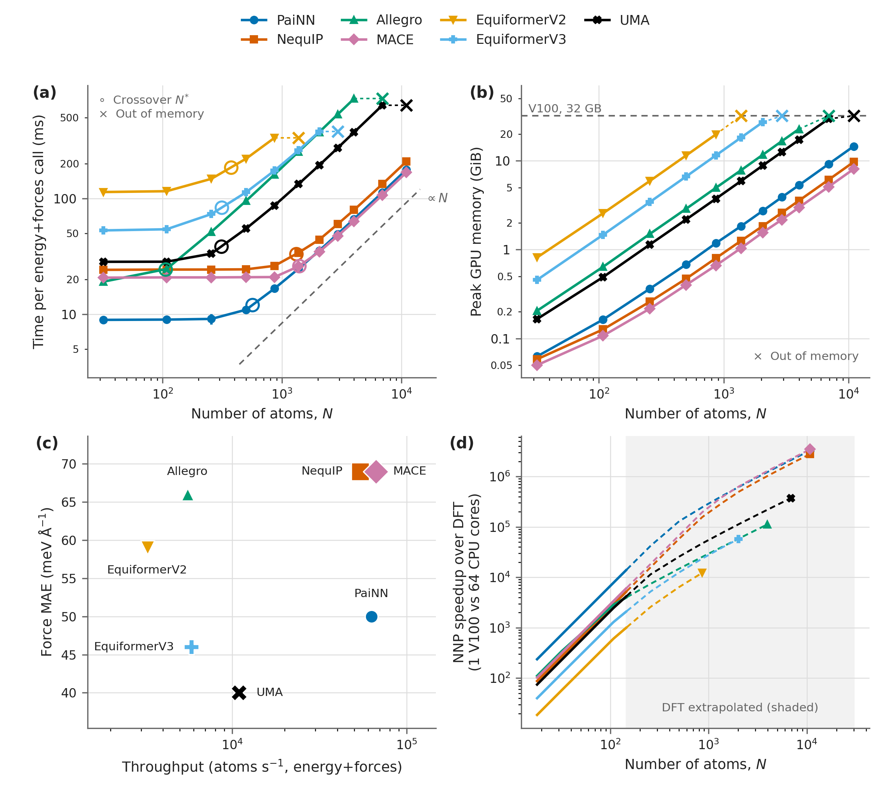
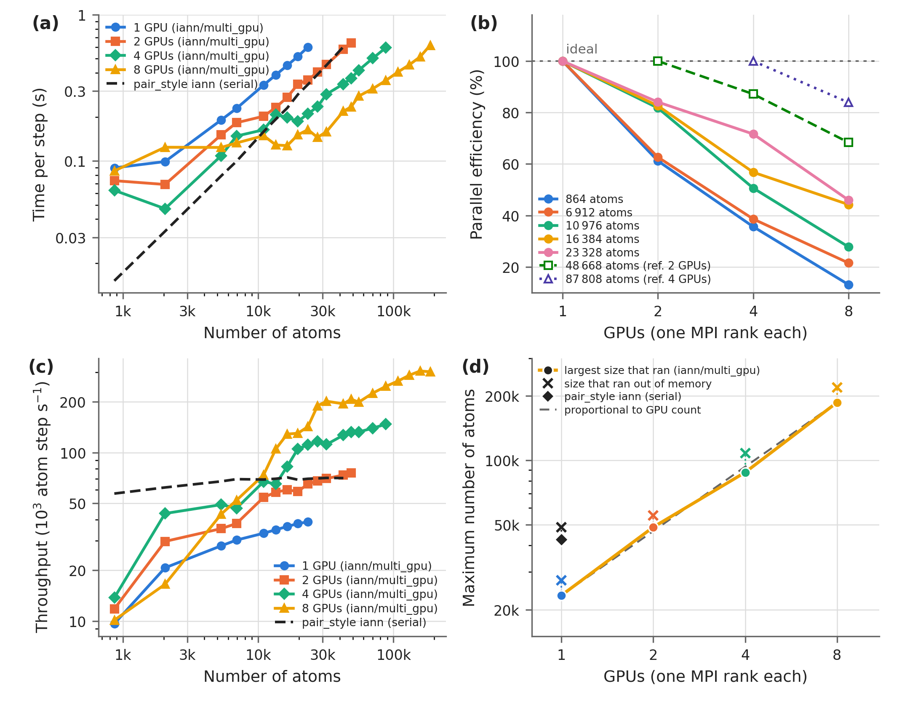

Performance
===========

Accuracy is the first criterion for choosing an architecture, but it is rarely the only one. For
molecular dynamics and high-throughput screening the cost per evaluation, the memory ceiling and
the parallel behaviour decide what is actually feasible. This page collects the measured cost of
the architectures and of the LAMMPS interface.

All numbers below were produced with IANN itself, using the same graph construction and the same
evaluation code for every architecture, so the comparison reflects the networks rather than
differences between codebases.

Inference cost across architectures
-----------------------------------

Measured on a single Tesla V100 (32 GB) in single precision (float32), on bulk supercells from 32
to 10,976 atoms at the 5.5 Å cutoff of the released models.

   Inference cost of the architectures. (a) Wall time per energy-and-force call against system
   size; open circles mark the crossover :math:`N^*`, crosses the size that ran out of memory.
   (b) Peak GPU memory versus the number of atoms. (c) Force MAE against sustained throughput.
   (d) Speedup over DFT (VASP, RPBE); the shaded region is where the DFT reference is
   extrapolated.

**There is a latency floor.** Below a certain system size the wall time per call does not depend
on the number of atoms at all, because the GPU is not saturated — the cost is kernel launch and
data transfer. The floor is 9.0 ms for PaiNN, 19–28 ms for NequIP, MACE, Allegro and UMA, 54 ms
for EquiformerV3 and 115 ms for EquiformerV2.

**The crossover** :math:`N^*` is where per-atom work starts to dominate the floor. It ranges from
roughly 100 atoms for Allegro to about 1,400 for MACE and NequIP. Above it, cost is linear in
:math:`N`, as the locality of the energy decomposition requires.

This gives a simple rule. For the few-hundred-atom slabs typical of surface catalysis you are
choosing a **latency floor**, and the marginal per-atom cost is nearly irrelevant. For bulk
systems of thousands of atoms you are choosing a **marginal cost**, where the architectures
differ by more than a factor of twenty. MACE, PaiNN and NequIP have the lowest marginal cost;
UMA, EquiformerV3, Allegro and EquiformerV2 the highest.

**Memory is often the binding constraint rather than speed.** Peak memory grows linearly with
system size for every architecture, but the intercepts differ by more than an order of magnitude.
On a 32 GB V100, PaiNN, NequIP and MACE reach 10,976 atoms while EquiformerV2 runs out at 864 —
so an architecture can be ruled out for a target system size before its speed matters at all.

**Accuracy and throughput trade off, but not strictly.** Panel (c) plots force MAE against
sustained throughput. PaiNN, NequIP and MACE sustain the highest throughput; UMA, EquiformerV3
and PaiNN give the lowest force errors. PaiNN appears in both groups, which is why the released
:doc:`foundation_models` use it.

**Against DFT**, the speedup spans orders of magnitude and grows with system size, reaching
:math:`\sim 10^6` for the largest cells measured, with about a factor of ten between the fastest
and slowest architecture. Note that the shaded region of panel (d) is extrapolated DFT, not
measured.

Per-architecture numbers — parameter counts, energy and force MAEs, latency floors, marginal
costs and memory ceilings — are tabulated in the *Model Selection* section of
:doc:`engine_models`.

Training on multiple GPUs
-------------------------

Evaluated on the curated MPtrj database at fixed batch size, over one to sixteen A100 GPUs with
one MPI rank each.

Speedup is close to linear in the GPU count, spanning 10.5× to 13.7× on 16 GPUs depending on the
architecture, with parallel efficiencies from 65.7 % to 86.0 %. Global throughput spans 323 to
3,892 structures per second on 16 GPUs — a much larger spread than the efficiency, because it
also carries the per-structure cost of the network. MACE, NequIP and PaiNN scale best, consistent
with their low memory footprints above.

Breaking one training step into its parts — data loading with neighbour-list construction,
host-to-device transfer, forward and backward, the gradient all-reduce, and the optimizer update
with gradient clipping — the forward/backward pass, data loading and the all-reduce dominate. If
scaling disappoints, the neighbour-list construction in the data loader is worth checking before
the network.

Distributed training is configured automatically from the scheduler environment; see
:doc:`parallelization` for how to launch it.

Multi-GPU inference in LAMMPS
-----------------------------

Evaluated with the PaiNN foundation model through ``pair_style iann/multi_gpu`` on rattled fcc Cu
supercells, over one to eight A100 GPUs (80 GB) with one MPI rank each. The serial
``pair_style iann`` is the baseline.

   Performance of the IANN LAMMPS interface on A100-80GB GPUs. (a) Time per MD step against the
   number of atoms for 1–8 GPUs. (b) Parallel efficiency against GPU count. (c) Throughput
   against the number of atoms. (d) Maximum number of atoms versus GPU count.

**The parallel pair style is not a free win at small GPU counts.** On one or two GPUs it is slower
than the serial baseline at every system size. The reason is ghost atoms: each rank must evaluate
a halo of atoms belonging to its neighbours, so the parallel run evaluates more atoms in total
than the serial one, and inter-GPU communication adds to each step. Beyond two GPUs the parallel
version overtakes the baseline for large systems.

**Parallel efficiency depends strongly on how many atoms each GPU gets.** At 864 atoms it falls
below 20 % on 8 GPUs; above about 23,000 atoms it holds near 50 %. Small systems on many GPUs are
the one configuration to avoid — at fewer than ~5,000 atoms, 8 GPUs give no improvement at all.

**Throughput** rises with GPU count for all but the smallest systems. At around 30,000 atoms,
8 GPUs deliver roughly 5× the throughput of 1 GPU under ``iann/multi_gpu`` and about 3× the
serial run.

**The reachable system size scales linearly with GPU count**, which is often the real reason to go
parallel: about 25,000 atoms on 1 GPU against 200,000 atoms on 8. Note that the serial pair style
reaches roughly twice the size of the single-GPU parallel run, again because it carries no ghost
atoms.

Choosing a configuration
------------------------

.. list-table::
   :header-rows: 1
   :widths: 30 70

   * - Situation
     - What to do
   * - Slabs of a few hundred atoms
     - Pick on latency floor and accuracy; PaiNN if throughput matters, UMA or EquiformerV3 if
       force accuracy does. Marginal cost is irrelevant at this size.
   * - Bulk MD, thousands of atoms
     - Pick on marginal cost and memory: MACE, PaiNN or NequIP. Run through
       :doc:`lammps`, not ASE.
   * - System larger than one GPU's memory
     - ``pair_style iann/multi_gpu``; the reachable size scales with the GPU count.
   * - Small system, many GPUs available
     - Do not distribute it. Run serial and use the GPUs for independent trajectories instead.
   * - Training is the bottleneck
     - Scale to multiple GPUs (:doc:`parallelization`), and check the data loader before
       blaming the network.

Reproducing these measurements
------------------------------

The benchmarks are ordinary IANN scripts. Inference cost is a loop over supercell sizes timing
one energy-and-force call, and the LAMMPS numbers come from a fixed-step MD run under
``pair_style iann`` or ``iann/multi_gpu``. See :doc:`prediction` for the calculator interface and
:doc:`lammps` for the pair styles.

.. note::
   Absolute timings depend on the GPU, the driver, the PyTorch build and the cutoff. The
   comparisons here hold the cutoff, precision and evaluation code fixed, so the *relative*
   ordering transfers to other hardware more reliably than the absolute numbers do.
